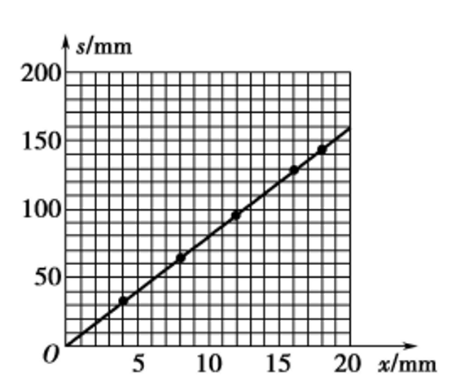
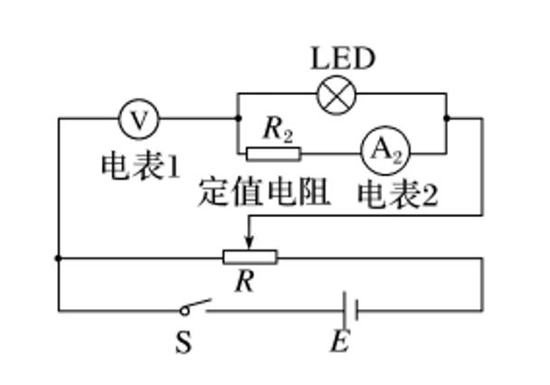

# 答案

| 1    | 2    | 3    | 4    | 5    | 6    | 7    | 8    | 9    | 10   |
| ---- | ---- | ---- | ---- | ---- | ---- | ---- | ---- | ---- | ---- |
| B    | B    | B    | C    | D    | B    | C    | BD   | AC   | BD   |

**11**

(1)15

(2)

(3)C

**12**

(1)F B D

(2)

(3)$\scriptstyle R_{x}={\frac{U}{I}}={\frac{I_{2}(R_{2}+R_{\mathrm{A2}})}{\frac{U_{\mathrm{V}}}{R_{\mathrm{V}}}-I_{2}}}$	$\scriptstyle I_{2}=1.5\;\mathrm{mA}$

**13**

(1) $16.0\;\mathrm{cmHg}$。

(2)$\begin{array}{c}{{l_{1}^{\prime}{=}22.5cm}}\\ {{l_{2}^{\prime}{=}7.5cm}}\end{array}$

**14**

(1)$\scriptstyle a={\frac{B^{2}L^{2}\ v_{0}+f R}{m R}}$

(2)$\scriptstyle t={\frac{m\ v_{0}R-B^{2}L^{2}s}{f R}}$

(3)

该方案的优点：利用电磁阻尼现象辅助刹车，可以使列车的加速度平稳减小；可以减小常规刹车的机械磨损

该方案的缺点：没有考虑列车车厢和内部线路等也是金属材质，进入磁场时会产生涡流对设备产生不良影响：励磁线圈也需要耗能：线框固定在列车上增加负载且容易出现故障。

**15**

(1)$E={\cfrac{2m v_{0}^{2}}{q L}}$

(2)$B_{0}=\frac{(4n+1)\,m v_{0}}{2q L}(\,n=0\,,1\,,2\,,3\,,\cdots)$

(3)

①$y_{\mathrm{m}}={\frac{2m^{2}\,g}{q^{2}\,B^{2}}}$

②$v_{\mathrm{m}}=\frac{2}{q B}(q E-m g)$

