**一、单项选择题：本题共7个小题，每小题4分，共28分。在每小题给出的四个选项中，只有一个选项符合题目要求。**

1.近年来，电动汽车（EV）取得了显著的进展，使其逐渐成为汽车市场的重要组成部分。电动汽车（EV）使用的电池主要是锂离子电池，其中包含磷酸铁锂和三元锂电池。研究表明，锂元素主要来自宇宙线高能粒子与星际物质的原子核产生的散裂反应，其中一种核反应方程为 $_6^{12}\mathrm{C}+_1^1\mathrm{H}\to_3^7\mathrm{Li}+2_1^1\mathrm{H}+\mathrm{X}$，式中的 X 为()

${{\mathrm{A.}}}&{{_{0}^{1}\mathrm{n}}}&{{\qquad}}&{{}}&{{}}&\\$

${{\mathrm{B.}}}&{{_{2}^{4}\mathrm{He}}}&{{\qquad}}&{{}}&{{}}&\\$

${{\mathrm{C.}}}&{{_{1}^{0}\mathrm{e}}}&{{\qquad}}&{{}}&{{}}&\\$

${{\mathrm{D.}}}&{{_{-1}^{0}\mathrm{e}}}\\$

2.星链是太空探索公司 SpaceX 的一项透过近地轨道卫星群，提供覆盖全球的高速互联网接入服务。截至目前已有超过6800颗卫星在轨。设地球半径为 $R$，假设有一颗卫星在距地球表面高度为 $h$ 的圆形轨道Ⅰ上做匀速圆周运动，运行周期为 $T$，到达轨道的 A 点时点火变轨进入椭圆轨道Ⅱ，到达轨道的近地点 B 时，再次点火进入近地轨道Ⅲ绕地做匀速圆周运动，引力常量为 $G$，不考虑其他星球的影响，则下列说法正确的是 ( )

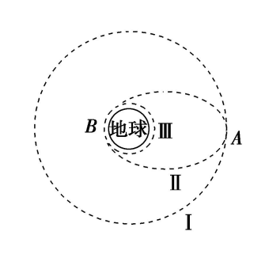

A．地球的质量可表示为 $\frac{4\pi^2 R^3}{G T^2}$

B．该卫星在轨道Ⅲ上 B 点的速率大于在轨道Ⅱ上 A 点的速率

C．卫星在圆轨道Ⅰ和圆轨道Ⅲ上做圆周运动时，轨道Ⅰ上动能小，引力势能大，机械能小

D．卫星从远地点 A 向近地点 B 运动的过程中，加速度变小

3.一辆小汽车在水平路面上由静止启动，在前 $5$ s 内做匀加速直线运动，$5$ s 末达到额定功率，之后保持以额定功率运动，其 $v$-$t$ 图象如图所示。已知汽车的质量为 $m = 1 \times 10^3 \, \mathrm{kg}$，汽车受到地面的阻力为车重的 $0.1$ 倍，$g$ 取 $10 \, \mathrm{m/s^2}$，则以下说法正确的是 ( )

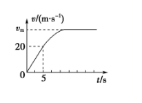

A．汽车在前 $5$ s 内的牵引力为 $5 \times 10^2 \, \mathrm{N}$

B．汽车的额定功率为 $100 \, \mathrm{kW}$

C．汽车速度为 $25 \, \mathrm{m/s}$ 时的加速度为 $5 \, \mathrm{m/s^2}$

D．汽车的最大速度为 $80 \, \mathrm{m/s}$

4.如图所示，一束由两种单色光混合的复色光沿 PO 方向射向一下表面为平面镜的玻璃砖上，得到三束光Ⅰ、Ⅱ、Ⅲ。下列有关这三束光的判断错误的是 ( ）

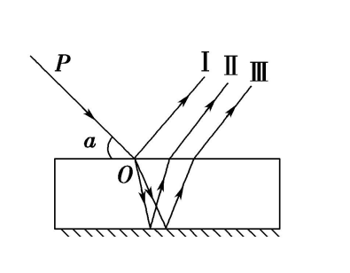

A．光束Ⅰ仍为复色光，光束Ⅱ、Ⅲ为单色光

B．光束Ⅱ在玻璃中的传播速度比光束Ⅲ小

C．增大 $\alpha$ 角且 $\alpha < 90^\circ$，光束Ⅱ、Ⅲ会远离光束Ⅰ

D．改变 $\alpha$ 角且 $\alpha < 90^\circ$，光束Ⅱ、Ⅲ一定与光束Ⅰ平行

5.一电阻分别通过四种不同形式的电流，四种电流随时间变化的情况如下列选项所示，在相同时间 $T$ ($T$ 为 $0.02 \, \mathrm{s}$ 的整数倍) 内电阻产生的热量最大的是 ( ）

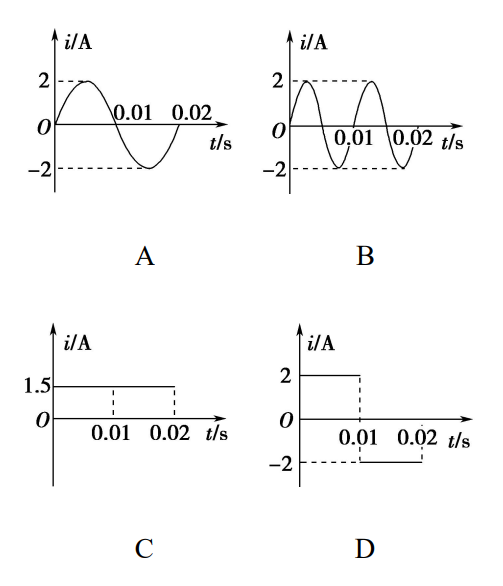

6.如图所示，质量为 $M$ 的物块 A 放置在光滑水平桌面上，右侧连接一固定于墙面的水平轻绳，左侧通过一倾斜轻绳跨过光滑定滑轮与一竖直轻弹簧相连。现将质量为 $m$ 的钩码 B 挂于弹簧下端，当弹簧处于原长时，将 B 由静止释放，当 B 下降到最低点时(未着地)，A 对水平桌面的压力刚好为零。轻绳不可伸长，弹簧始终在弹性限度内，物块 A 始终处于静止状态。以下判断错误的是 ( )

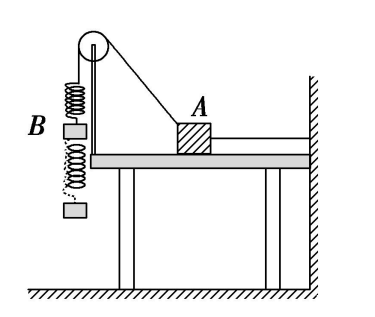

A．$M < 2m$

B．$2m < M < 3m$

C．在 B 从释放位置运动到最低点的过程中，所受合力对 B 先做正功后做负功

D．在 B 从释放位置运动到速度最大的过程中，B 克服弹簧弹力做的功等于 B 机械能的减少

7.真空中有一点电荷 $Q$，MN 是这个点电荷电场中的一条水平直线，如图所示，A、B、C 是直线 MN 上的三个点，B 是 A、C 的中点，点电荷 $Q$ 位于 A 点正上方 O 处(未画出)。设 A、B、C 三点场强大小分别为 $E_A$、$E_B$、$E_C$，且 $E_B = \frac{1}{2} E_A$，则 $E_C$ 的值为 ( )

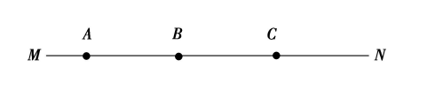

A. $\frac{1}{3} E_A$

B. $\frac{1}{4} E_A$

C. $\frac{1}{5} E_A$

D. $\frac{1}{6} E_A$

**二、多项选择题：本题共3个小题，每小题6分，共18分。在每小题给出的四个选项中，有多项选项符合题目要求。全部选对的得6分，选对但不全的得3分，有选错的得0分**

8.图甲为某一列沿 $x$ 轴传播的简谐横波在 $t = 0.5 \, \mathrm{s}$ 时刻的波形图，图乙为参与波动的质点 $M$ 的振动图象，则下列说法正确的是( ）

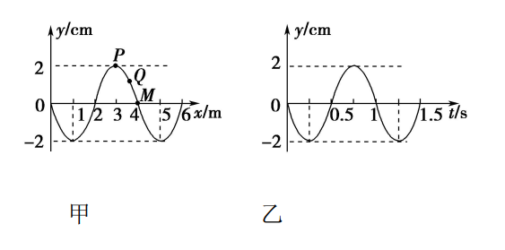

A．该简谐波的传播速度为 $2 \, \mathrm{m/s}$

B．这列波的传播方向沿 $x$ 轴正方向

C．$t = 2.0 \, \mathrm{s}$ 时 $M$ 质点的振动速度小于 $Q$ 质点的振动速度

D．从 $t = 0$ 时刻开始 $P$ 质点的振动方程为 $y = 2 \sin \left(2\pi t - \frac{\pi}{2}\right) \, \mathrm{(cm)}$

9.如图 1 所示，$M$ 为一电动机，当滑动变阻器的触头从一端滑到另一端的过程中，两电压表的读数随电流表读数的变化情况如图 2 所示，已知电流表读数在 $0.2 \, \mathrm{A}$ 以下时，电动机没有发生转动，不考虑电表对电路的影响，以下判断不正确的是 ( ）

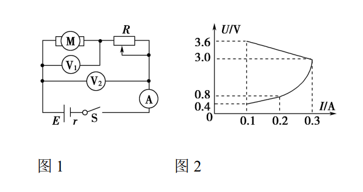

A．电路中的电源电动势为 $3.6 \, \mathrm{V}$

B．电动机的电阻为 $4 \, \Omega$

C．此电路中，电动机的最大输出功率为 $0.9 \, \mathrm{W}$

D．变阻器的最大阻值为 $32 \, \Omega$

10.如图所示为某种弹射装置的示意图，光滑的水平导轨 $MN$ 右端 $N$ 处与水平传送带理想连接，传送带长度 $L = 4.0 \, \mathrm{m}$，传送带以恒定速率 $v = 3.0 \, \mathrm{m/s}$ 沿顺时针方向匀速传送。三个质量均为 $m = 1.0 \, \mathrm{kg}$ 的滑块 $A$、$B$、$C$ 置于水平导轨上，开始时滑块 $B$、$C$ 之间用细绳相连，其间有一压缩的轻弹簧，处于静止状态。滑块 $A$ 以初速度 $v_{0} = 2.0 \, \mathrm{m/s}$ 沿 $B$、$C$ 连线方向向 $B$ 运动，$A$ 与 $B$ 发生弹性碰撞后黏合在一起，碰撞时间极短，可认为 $A$ 与 $B$ 碰撞过程中滑块 $C$ 的速度仍为零。因碰撞使连接 $B$、$C$ 的细绳受到扰动而突然断开，弹簧伸展，从而使 $C$ 与 $A$、$B$ 分离。滑块 $C$ 脱离弹簧后以速度 $v_{C} = 2.0 \, \mathrm{m/s}$ 滑上传送带，并从右端滑出落至地面上的 $P$ 点。已知滑块 $C$ 与传送带之间的动摩擦因数 $\mu = 0.2$，重力加速度 $g$ 取 $10 \, \mathrm{m/s^{2}}$，以下判断正确的是 ( ）

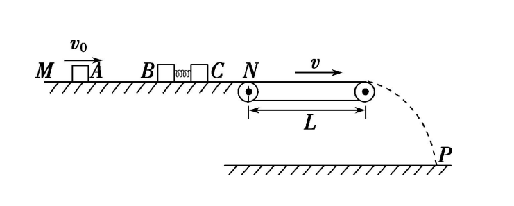

A. 滑块 $C$ 在传送带上做加速运动的时间为 $1 \, \mathrm{s}$

B. 滑块 $C$ 从传送带右端滑出时的速度大小为 $3 \, \mathrm{m/s}$

C. 滑块 $B$、$C$ 用细绳相连时弹簧的弹性势能 $E_{\mathrm{p}} = 2.0 \, \mathrm{J}$

D. 若每次实验开始时弹簧的压缩情况相同，要使滑块 $C$ 总能落至 $P$ 点，则滑块 $A$ 与滑块 $B$ 碰撞前速度的最大值 $v_{m}$ 是 $7.1 \, \mathrm{m/s}$

**三、实验题：本题共2个小题，共14分。**

11.（6分）

​	某班物理小组计划用一台具有摄像功能的数码相机来研究弹簧做功的规律。该小组设计的装置如图甲所示，光滑水平桌面(厚度不计)离地高度为 $H = 0.8\;\mathrm{m}$，轻质弹簧左端固定于竖直挡板上，挡板到桌面右端的距离恰好等于弹簧的原长。实验时将一质量为 $m = 200\;\mathrm{g}$ 的小球(可视为质点)置于被压缩弹簧的右端，释放后小球在弹力的作用下向右运动，并离开桌面做平抛运动(不计空气阻力)，用数码相机将小球运动过程拍成视频，改变小球的释放位置再拍，获得多个视频，每个视频都由相同时间间隔的照片连贯而成，通过电脑将这些照片按时间顺序制作成频闪照片(如图乙所示)，筛选出 5 张频闪照片，用刻度尺测得照片中的桌面离地高度 $h = 50.0\;\mathrm{mm}$，再测出 5 张照片中的 $x$ 和 $s$，记录到下表中，取重力加速度 $g = 10\;\mathrm{m/s^2}$。

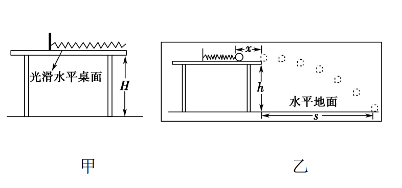

| 频闪照片序号 | 1    | 2    | 3    | 4     | 5     |
| ------------ | ---- | ---- | ---- | ----- | ----- |
| $x$ (mm)     | 4.0  | 8.0  | 12.0 | 16.0  | 18.0  |
| $s$ (mm)     | 32.0 | 64.2 | 95.9 | 128.6 | 143.3 |

(1) 分析图乙中小球位置的分布规律，可知该相机每秒能拍摄________张照片。 

(2) 根据表中数据在下图中作出 $s$-$x$ 图象。

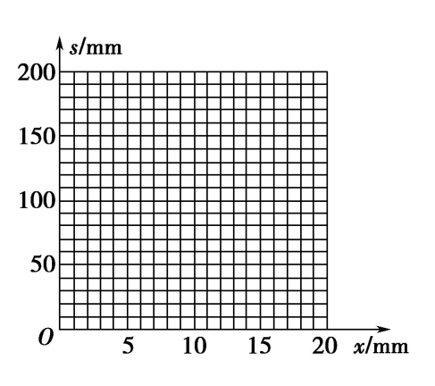

(3) 若测得 $s$-$x$ 图象的斜率为 $k$，则弹簧对小球做的功 $W$ 可以表示成 ________（填选项前的字母）

$\mathrm{A.}\ \ \,W = \frac{m g k^{2}}{4h}x^{2}$

$\mathrm{B.}\ \ \,W = \frac{m g H^{2}k^{2}}{4h^{2}}x^{2}$

$\mathrm{C.}\ \ \,W = \frac{m g H k^{2}}{4h^{2}}x^{2}$

$\mathrm{D.}\ \ \,W = \frac{1}{2}k x^{2}$

12.（8分）

​	LED 绿色照明技术已经走进我们的生活．某实验小组要精确测定额定电压为 $3\;\mathrm{V}$ 的 LED 灯正常工作时的电阻，已知该灯正常工作时电阻大约 $500\;\Omega$，电学符号与小灯泡电学符号相同．实验室提供的器材有： 

A．电流表 A1(量程为 $0$ 至 $50\;\mathrm{mA}$，内阻 $R_{A1} \approx 3\;\Omega$) 

B．电流表 A2(量程为 $0$ 至 $3\;\mathrm{mA}$，内阻 $R_{A2} = 15\;\Omega$) 

C．定值电阻 $R_1 = 697\;\Omega$ 

D．定值电阻 $R_2 = 1985\;\Omega$ 

E．滑动变阻器 $R$($0$ 至 $20\;\Omega$)一只 

F．电压表 $V$ (量程为 $0$ 至 $12\;\mathrm{V}$，内阻 $R_{V} = 1\;k\Omega$) 

G．蓄电池 $E$ (电动势为 $12\;\mathrm{V}$，内阻很小) 

H．开关 $S$ 一只

(1) 如图下图所示，请选择合适的器材，电表 1 为______，电表 2 为______，定值电阻为________(填写器材前的字母编号)

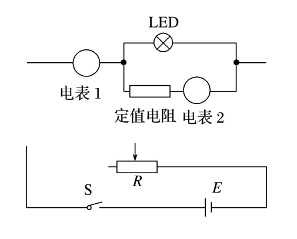

(2) 将采用的电路图补充完整。

(3) 写出测量 LED 灯正常工作时的电阻表达式 $R_x =$_______（用测量量字母和已知字母表示），当表达式中的 (填字母) 达到______，记下另一电表的读数代入表达式，其结果为 LED 灯正常工作时电阻。

**四、计算题：本题共3个小题，共40分。**

13.（10分）

​	在温度为 $300\;\mathrm{K}$ 的环境下，在两端封闭、粗细均匀的 U 形细玻璃管内有一股水银柱，水银柱的两端各封闭有一段空气。当 U 形管两端竖直朝上时，左、右两边空气柱的长度分别为 ${\mathit{l}}_{1} = 18.0\;\mathrm{cm}$ 和 ${\mathit{l}}_{2} = 12.0\;\mathrm{cm}$，左边气体的压强为 $12.0\;\mathrm{cmHg}$。

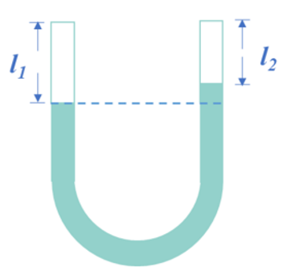

(1) 将温度升高到 $400\;\mathrm{K}$，求左边气体的压强；

(2) 现将 U 形管缓慢平放在水平桌面上，没有气体从管的一边通过水银逸入另一边。求 U 形管平放时两边空气柱的长度。（在整个过程中，气体温度不变）。

14.（14分）

​	某研学小组设计了一个辅助列车进站时快速刹车的方案。如图所示，在站台轨道下方埋有一励磁线圈，通电后形成竖直方向的磁场 (可视为匀强磁场) 。在车身下方固定一矩形线框，利用线框进入磁场时所受的安培力，辅助列车快速刹车。已知列车的总质量为 $m$，车身长为 $s$，线框的短边 $ab$ 和 $cd$ 分别安装在车头和车尾，长度均为 $L$ ($L$ 小于匀强磁场的宽度)，整个线框的电阻为 $R$。站台轨道上匀强磁场区域足够长，车头进入磁场瞬间的速度为 $v_{0}$，假设列车停止前所受铁轨及空气阻力的合力恒为 $f$。已知磁场的磁感应强度的大小为 $B$，车尾进入磁场瞬间，列车恰好停止。

(1) 求列车车头刚进入磁场瞬间线框中的电流大小 $I$ 和列车的加速度大小 $a$；

(2) 求列车从车头进入磁场到停止所用的时间 $t$；

(3) 请你评价该设计方案的优点和缺点 (优、缺点至少写一种) 。

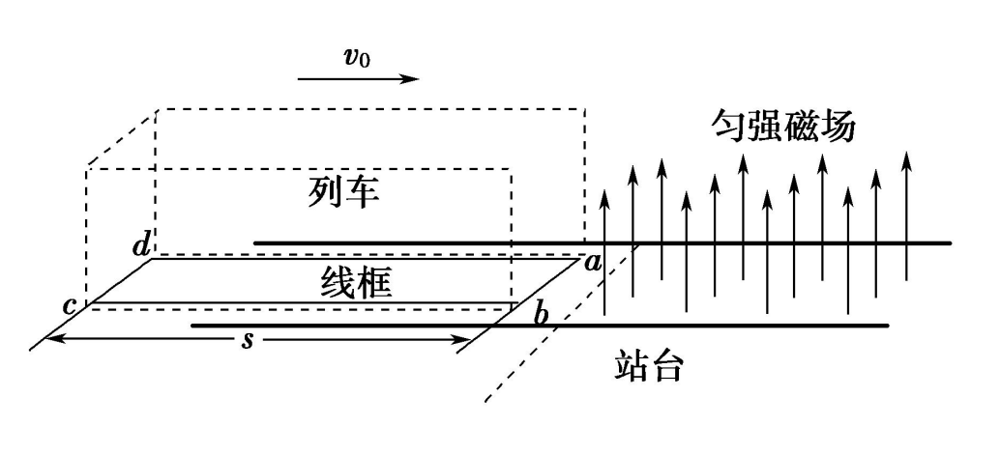

15.（16分）

​	如图所示，空间直角坐标系 $Oxyz$ 中，有一棱长为 $L$ 的正方体区域，其顶点分别是 $a$、$b$、$c$、 $d$、$O$、$b'$、$c'$、$d'$，其中 $a$、$b'$、$d'$ 在坐标轴上，区域内（含边界）分布着电场或磁场。$t = 0$ 时刻，一质量为 $m$、电荷量为 $q$ 的带正电粒子，以初速度 $v$ 从 $a$ 点沿 $ad$ 方向射入区域，不计粒子重力。

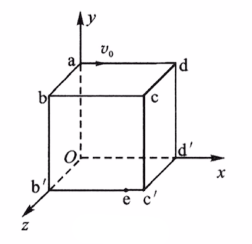

（1）若区域内仅分布着沿 $y$ 轴负方向的匀强电场，则粒子恰能从 $d$ 点离开区域，求电场强度 $E$ 的大小；

（2）若区域内仅交替分布着方向沿 $x$ 轴负方向的磁场 $B_x$ 和沿 $y$ 轴正方向的磁场 $B_y$，且磁感应强度 $B_x$ 和 $B_y$ 的大小随时间 $t$ 周期性变化的关系如下图所示，则要使粒子从平面 $cdd'c'$ 离开区域，且离开时速度方向与平面 $cdd'c’$ 的夹角为 $60^\circ$，求磁感应强度 $B_0$ 的大小的可能取值；

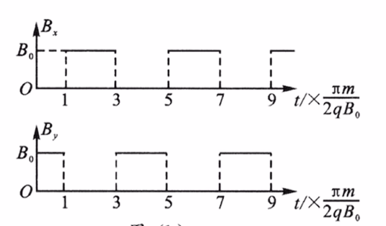

（3）若考虑粒子重力，且 $xoy$ 平面下方和 $yoz$ 平面左侧存在方向与 $z$ 轴负方向相同的磁场 $B_1$，并将粒子在 $O$ 点静止释放，粒子的运动图线如图所示。已知：在向心加速度公式 $a_{_n} = \frac{\nu^2}{\rho}$ 中，$\rho$ 为曲线上该点的曲率半径，此曲线在最低点的曲率半径为该点到 $x$ 轴距离的 $2$ 倍，重力加速度为 $g$。求：

① 粒子在运动过程中第一次下降的最大距离；

② 当在上述磁场中加一竖直向上场强为 $E$ ($E > \frac{m g}{q}$) 的匀强电场时，粒子从 $O$ 静止释放后获得的最大速率 $v_m$。

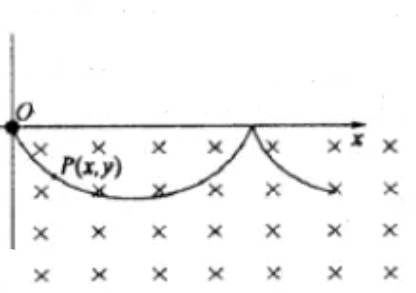